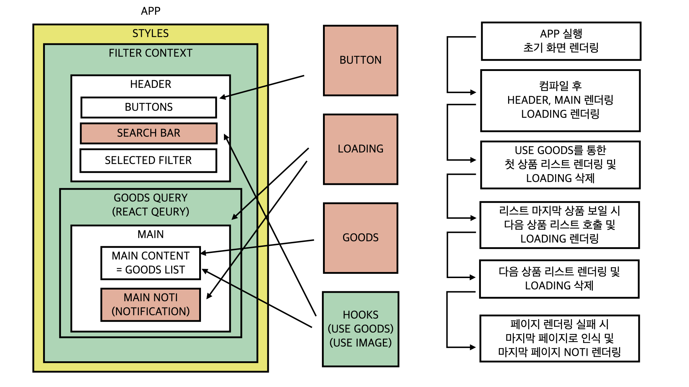
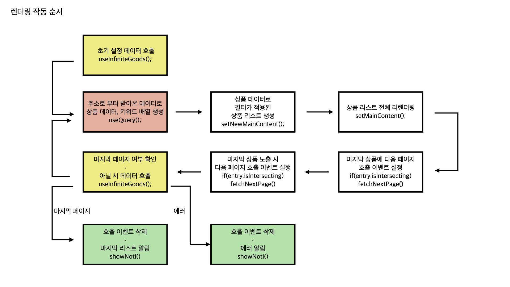

무신사의 채용 코딩 테스트를 진행할 수 있는 기회를 주셔서 무척 감사합니다!

아래에 간략한 구현 내용 및 간단한 컴포넌트의 구성 및 흐름, 사용된 도구들에 대해 적었습니다.

자세한 구현 과정은 아래의 링크를 참고해주시기 바랍니다.

[https://jinjeonimum.notion.site/MUSINSA-CODING-TEST-PROGRESS-f84d00d548bb4ef9972609bd96d58ab0](https://www.notion.so/f84d00d548bb4ef9972609bd96d58ab0)

## INSTALLATION

현재 프로젝트를 `clone`한 뒤, `main` 브랜치에서 필요한 내용들을 `npm`으로 설치한 뒤 실행합니다.

```
git clone https://github.com/JinJeon/musinsa.git

cd musinsa

npm install

npm run start
```

## DESCRIPTION

제공된 요구사항에 맞추어 개발을 진행했습니다.

- **기본 구동 환경** : 브라우저는 Chrome을 기준으로 개발을 진행했으며, 스마트폰과 태블릿의 화면 비율에 맞도록 제작했습니다.
- **상품 목록 렌더링**: 주어진 링크를 통해 한 링크를 하나의 페이지로 인식하여 상품 목록을 렌더링하였으며, 첫 렌더링 시 첫 페이지만 나오고, 화면이 밑으로 내려갈 시 무한 스크롤이 가능하도록 했습니다.
- **상품 목록 필터**: 화면 상단의 고정된 `header`에 있는 필터 버튼들은 토글이 가능하며, 상품 목록이 해당 필터에 맞추어 필터링이 이루어지도록 했습니다.
- **자동완성 검색 필터**: 조회된 데이터에 한해 데이터의 키워드들을 모아, 단어 입력 시 자동 완성된 필터를 제공하고, 해당 필터에 맞추어 필터링이 이루어지도록 했습니다.

## FLOW





## TOOLS

- **React**: 컴포넌트를 이용한 화면 구성 및 다양한 상태 관리 툴(Context, React qeury) 등 여러 이점이 있어, React를 이용해 개발을 진행했습니다.
- **TypeScript**: 컴파일 단계에서 잘못된 타입 지정을 잡아주어, 잘못된 결과가 나올 수 있는 가능성을 낮추는 안정성을 갖고 있어 사용했습니다.
- **ESLint, Prettier**: 코드 작성 과정 중 잘못 작성된 코드들을 빠르게 잡아 수정하고, 정해진 형식을 유지하기 위해 사용했습니다.
- **Styled Component**: React에서 컴포넌트의 스타일을 적용하고, 테마를 통해 스타일의 일관성을 유지하기 위해 사용했습니다.
- **React Context ∙ Reducer**: 서버와 무관한 클라이언트의 상태 관리를 위해 사용했으며, 필터의 상태를 관리합니다.
- **React Qeury**: 서버로 부터 데이터를 제공받는 상태를 관리하기 위해 사용했으며, 상품 목록의 상태 및 페이지를 관리합니다.
